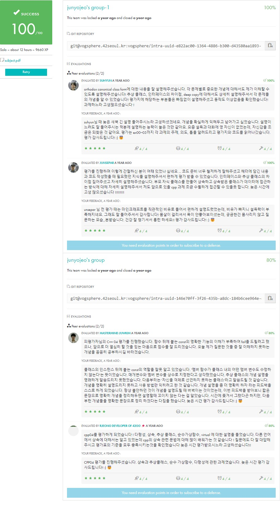

<div align="center">
  <h1>💻 CPP Module 04</h1>
  <p>다형성과 추상 클래스 | 인터페이스 설계</p>

  
  
  <div>
    
    
  </div>

  ### 학습 내용
  - 추상 클래스와 순수 가상 함수
  - 인터페이스 설계 패턴
  - 런타임 다형성 구현
  - 가상 소멸자의 필요성
  - 깊은 복사와 얕은 복사
</div>

## 목차
- [개요](#개요) 🎯
- [프로젝트 설정](#프로젝트-설정) 🛠
- [핵심 개념](#핵심-개념) 💡
- [구현 가이드](#구현-가이드) 📝
- [메모리 관리](#메모리-관리) 🔧
- [디버그 & 테스트](#디버그--테스트) 🔍
- [평가 가이드](#평가-가이드) ✅
- [참고 자료](#참고-자료) 📚

### 🎯 개요

이 모듈은 C++의 다형성과 추상 클래스를 다루는 프로젝트입니다.

#### 핵심 요구사항
```cpp
✓ Orthodox Canonical Form 구현
✓ 가상 소멸자와 순수 가상 함수 사용
✓ 깊은 복사와 메모리 관리
✓ 추상 클래스와 인터페이스 설계
```

### 🛠 프로젝트 설정

#### 1. 파일 구조
```bash
.
├── Makefile
├── main.cpp
├── Animal.hpp
├── Animal.cpp
├── Dog.hpp
├── Dog.cpp
├── Cat.hpp
├── Cat.cpp
├── Brain.hpp
└── Brain.cpp
```

#### 2. Makefile
```makefile
NAME        = animal
CXX         = c++
CXXFLAGS    = -Wall -Wextra -Werror -std=c++98

SRCS        = main.cpp \
              Animal.cpp Dog.cpp Cat.cpp Brain.cpp \
              AMateria.cpp Ice.cpp Cure.cpp \
              Character.cpp MateriaSource.cpp
              
OBJS        = $(SRCS:.cpp=.o)

all: $(NAME)

$(NAME): $(OBJS)
    $(CXX) $(CXXFLAGS) $(OBJS) -o $(NAME)

clean:
    rm -f $(OBJS)

fclean: clean
    rm -f $(NAME)

re: fclean all

.PHONY: all clean fclean re
```

### 💡 핵심 개념

#### 1. 추상 클래스 설계
```cpp
// Animal.hpp
class Animal {
protected:
    std::string _type;  // protected 멤버

public:
    // Orthodox Canonical Form
    Animal(void);
    Animal(const Animal& other);
    Animal& operator=(const Animal& other);
    virtual ~Animal(void);  // 가상 소멸자 필수!

    // 순수 가상 함수로 추상 클래스 만들기
    virtual void makeSound(void) const = 0;
    
    // 일반 멤버 함수
    std::string getType(void) const;
};

// Dog.hpp - 구체 클래스
class Dog : public Animal {
private:
    Brain* _brain;  // 동적 할당 멤버

public:
    // Orthodox Canonical Form 모두 구현
    Dog(void);
    Dog(const Dog& other);
    Dog& operator=(const Dog& other);
    virtual ~Dog(void);

    // 순수 가상 함수 구현
    void makeSound(void) const override;
};
```

#### 2. 깊은 복사 구현
```cpp
// Dog.cpp
Dog::Dog(void) : Animal() {
    std::cout << "Dog default constructor called" << std::endl;
    _type = "Dog";
    _brain = new Brain();  // 동적 할당
}

Dog::Dog(const Dog& other) : Animal(other) {
    std::cout << "Dog copy constructor called" << std::endl;
    _brain = new Brain(*other._brain);  // 깊은 복사
}

Dog& Dog::operator=(const Dog& other) {
    std::cout << "Dog assignment operator called" << std::endl;
    if (this != &other) {
        Animal::operator=(other);     // 기본 클래스 복사
        delete _brain;                // 기존 메모리 해제
        _brain = new Brain(*other._brain);  // 깊은 복사
    }
    return *this;
}

Dog::~Dog(void) {
    std::cout << "Dog destructor called" << std::endl;
    delete _brain;  // 메모리 해제
}
```

#### 3. 인터페이스 설계
```cpp
// ICharacter.hpp
class ICharacter {
public:
    virtual ~ICharacter(void) {}
    virtual void equip(AMateria* m) = 0;
    virtual void unequip(int idx) = 0;
    virtual void use(int idx, ICharacter& target) = 0;
    virtual std::string const & getName(void) const = 0;
};

// Character.hpp - 인터페이스 구현
class Character : public ICharacter {
private:
    std::string _name;
    static const int _inventorySize = 4;
    AMateria* _inventory[_inventorySize];

public:
    Character(std::string const & name);
    Character(const Character& other);
    Character& operator=(const Character& other);
    virtual ~Character(void);

    // 인터페이스 메서드 구현
    void equip(AMateria* m) override;
    void unequip(int idx) override;
    void use(int idx, ICharacter& target) override;
    std::string const & getName(void) const override;
};
```

### 🔧 메모리 관리

#### 1. RAII 패턴 적용
```cpp
// Character.cpp
Character::Character(std::string const & name) : _name(name) {
    // 생성자에서 초기화
    for (int i = 0; i < _inventorySize; i++) {
        _inventory[i] = nullptr;
    }
}

Character::~Character(void) {
    // 소멸자에서 정리
    for (int i = 0; i < _inventorySize; i++) {
        delete _inventory[i];
    }
}

// 예외 안전한 복사 생성자
Character::Character(const Character& other) : _name(other._name) {
    for (int i = 0; i < _inventorySize; i++) {
        _inventory[i] = other._inventory[i] ? 
                       other._inventory[i]->clone() : nullptr;
    }
}

// 예외 안전한 대입 연산자
Character& Character::operator=(const Character& other) {
    if (this != &other) {
        _name = other._name;
        // 기존 메모리 정리
        for (int i = 0; i < _inventorySize; i++) {
            delete _inventory[i];
            _inventory[i] = other._inventory[i] ? 
                           other._inventory[i]->clone() : nullptr;
        }
    }
    return *this;
}
```

#### 2. 메모리 누수 방지
```cpp
// MateriaSource.hpp
class MateriaSource : public IMateriaSource {
private:
    static const int _maxLearn = 4;
    AMateria* _learned[_maxLearn];

public:
    void learnMateria(AMateria* m) override {
        if (!m) return;  // null 체크

        for (int i = 0; i < _maxLearn; i++) {
            if (!_learned[i]) {
                _learned[i] = m;
                return;
            }
        }
        delete m;  // 저장 공간 없으면 해제
    }

    AMateria* createMateria(std::string const & type) override {
        for (int i = 0; i < _maxLearn; i++) {
            if (_learned[i] && _learned[i]->getType() == type) {
                return _learned[i]->clone();  // 깊은 복사본 반환
            }
        }
        return nullptr;  // 실패시 null
    }
};
```

#### 3. 예외 처리
```cpp
void Character::equip(AMateria* m) {
    if (!m) return;  // null 체크
    
    try {
        for (int i = 0; i < _inventorySize; i++) {
            if (!_inventory[i]) {
                _inventory[i] = m;
                return;
            }
        }
        delete m;  // 장착 실패시 해제
    } catch (...) {
        delete m;  // 예외 발생시 해제
        throw;     // 예외 재전파
    }
}

void Character::unequip(int idx) {
    if (idx < 0 || idx >= _inventorySize) return;
    if (!_inventory[idx]) return;
    
    _inventory[idx] = nullptr;  // 메모리 해제하지 않음
}
```

### 🔍 디버그 & 테스트

#### 1. 메모리 테스트
```cpp
// main.cpp
void testMemoryLeaks(void) {
    // 1. 기본 생성/소멸 테스트
    {
        Animal* dog = new Dog();
        Animal* cat = new Cat();
        
        delete dog;
        delete cat;
    }
    
    // 2. 깊은 복사 테스트
    {
        Dog original;
        {
            Dog copy = original;  // 복사 생성자
        }  // copy 소멸
    }  // original 소멸
    
    // 3. Materia 시스템 테스트
    {
        IMateriaSource* src = new MateriaSource();
        src->learnMateria(new Ice());
        src->learnMateria(new Cure());
        
        ICharacter* me = new Character("me");
        AMateria* tmp;
        
        tmp = src->createMateria("ice");
        me->equip(tmp);
        
        delete me;
        delete src;
    }
}
```

#### 2. Valgrind 사용법
```bash
# 컴파일 (디버그 심볼 포함)
make re
c++ -Wall -Wextra -Werror -std=c++98 -g *.cpp -o animal

# 메모리 누수 검사
valgrind --leak-check=full ./animal

# 자세한 출력
valgrind --leak-check=full --show-leak-kinds=all \
         --track-origins=yes ./animal

# 기대하는 출력
==12345== All heap blocks were freed -- no leaks are possible
```

#### 3. 에러 케이스 테스트
```cpp
void testErrorCases(void) {
    // 1. null 포인터 처리
    Character ch("test");
    ch.equip(nullptr);  // 안전하게 처리되어야 함
    
    // 2. 잘못된 인덱스
    ch.unequip(-1);     // 무시되어야 함
    ch.use(4, ch);      // 무시되어야 함
    
    // 3. 중복 해제 방지
    AMateria* m = new Ice();
    ch.equip(m);
    ch.unequip(0);      // m을 delete하면 안 됨
    
    // 4. 가득 찬 인벤토리
    for (int i = 0; i < 5; i++) {
        AMateria* tmp = new Ice();
        ch.equip(tmp);  // 5번째는 자동으로 해제되어야 함
    }
}
```

### ✅ 평가 가이드

#### 1. 평가 준비 체크리스트
```cpp
// 1. Orthodox Canonical Form
□ 모든 클래스가 다음을 포함하는가:
    □ 기본 생성자
    □ 복사 생성자 (깊은 복사)
    □ 대입 연산자 (깊은 복사)
    □ 소멸자 (가상 소멸자)

// 2. 메모리 관리
□ 메모리 누수가 없는가
□ valgrind 검사 통과
□ 모든 new에 대응하는 delete 존재
□ 예외 발생 시 메모리 정리

// 3. 클래스 설계
□ 추상 클래스 올바르게 구현
□ 가상 함수 적절히 사용
□ 인터페이스 설계 올바름
□ protected/private 적절히 사용
```

#### 2. 주요 평가 질문과 답변
```cpp
// Q: 가상 소멸자를 사용한 이유는?
A: "다형성을 사용할 때 자식 클래스의 소멸자가 호출되지 않는 문제를 
    방지하기 위해서입니다. 예를 들어:"

Animal* dog = new Dog();
delete dog;  // 가상 소멸자 없으면 Dog의 소멸자 미호출

// Q: 깊은 복사가 필요한 이유는?
A: "포인터 멤버변수가 있을 때 얕은 복사는 메모리 공유 문제를 
    일으킵니다. Brain 예제로 설명하면:"

Dog dog1;
Dog dog2 = dog1;  // 얕은 복사시 같은 Brain 포인터 공유
// dog1이나 dog2 소멸시 다른 객체의 Brain이 댕글링 포인터가 됨

// Q: RAII는 어떻게 적용했나요?
A: "리소스의 수명을 객체의 수명과 일치시켜 자동으로 관리되게 했습니다.
    Character 클래스를 예로 들면:"

Character::Character() {
    // 생성자에서 초기화
    for (int i = 0; i < 4; i++)
        _inventory[i] = nullptr;
}

Character::~Character() {
    // 소멸자에서 자동 정리
    for (int i = 0; i < 4; i++)
        delete _inventory[i];
}
```

#### 3. 구현 시 주의사항
```cpp
// 1. 메모리 관리
- new 실패시 예외 처리
- 대입 연산자에서 자기 대입 검사
- unequip()에서 delete 하지 않기
- 임시 객체 자동 삭제 보장

// 2. 다형성
- 순수 가상 함수 선언과 구현 구분
- override 키워드 사용
- 기본 클래스 포인터로 테스트

// 3. 예외 안전성
- 리소스 누수 방지
- 강력한 예외 보장 구현
- 복사 생성/대입시 예외 처리
```

### 📚 참고 자료
- [C++ Orthodox Canonical Form](https://isocpp.org/wiki/faq/virtual-functions#virtual-dtors)
- [RAII and Exception Safety](https://isocpp.github.io/CppCoreGuidelines/CppCoreGuidelines#r-resource-management)
- [Valgrind Quick Start](https://valgrind.org/docs/manual/quick-start.html)